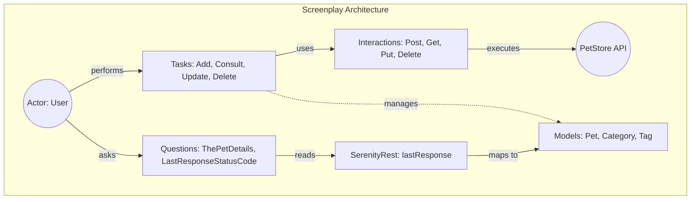

# PetStore API Automation - Serenity BDD & Screenplay

[](https://serenity-bdd.info/)
[](https://www.oracle.com/java/technologies/downloads/)
[](https://gradle.org/)


Professional API test automation project for the [Swagger PetStore](https://petstore.swagger.io) using the modern **Screenplay Pattern** with **Serenity BDD**.

## 📑 Index

- [🚀 Project Overview](#-project-overview)
- [✨ Key Features](#-key-features)
- [📂 Project Structure](#-project-structure)
- [📋 Prerequisites](#-prerequisites)
- [⚙️ Installation & Setup](#-installation--setup)
- [🏃 Executing Tests](#-executing-tests)
- [📊 Reports](#-reports)
- [✅ Quality Standards & Best Practices](#-quality-standards--best-practices)
  - [Design Patterns Implemented](#design-patterns-implemented)
  - [SOLID Principles](#solid-principles)
- [🛠 Tech Stack](#-tech-stack)


## 🚀 Project Overview

This project provides a comprehensive automated testing suite for the PetStore API, covering the complete lifecycle of a "Pet" resource through CRUD (Create, Read, Update, Delete) operations. It is designed to demonstrate high-quality automation standards, emphasizing maintainability, readability, and scalability.

## ✨ Key Features

- **Fluent API Testing**: Leverage Serenity RestAssured for readable and powerful API interactions.
- **Screenplay Pattern**: Modular and reusable test components following an actor-centric approach.
- **Living Documentation**: Automatically generated rich reports with step-by-step execution details.
- **Data Driven Testing**: Easily extensible with external data sources or object-oriented data models.
- **Fail-Safe Execution**: Configured to continue tests on failure to gather maximum insights.


## 📂 Project Structure

```text
src
└── test
    ├── java/com/petstore
    │   ├── hooks            # Setup/Teardown logic
    │   ├── models           # Data Transfer Objects (DTOs)
    │   ├── questions        # Classes to query system state
    │   ├── stepdefinitions  # Cucumber step mappings
    │   └── tasks            # Executable business actions
    └── resources
        ├── features         # Gherkin feature files
        └── serenity.conf    # Serenity configuration
```


The project follows the **Screenplay Pattern**, which shifts the focus from "Page Objects" (which can become bloated) to "Actors" who perform "Tasks" and ask "Questions".



## 📋 Prerequisites

- **Java Development Kit (JDK)**: Version 23 or higher is required.
- **IDE**: IntelliJ IDEA (recommended), Eclipse, or VS Code with Java extensions.
- **Gradle**: The project uses the Gradle Wrapper (`gradlew`), so a global install is not required.

## ⚙️ Installation & Setup

1. **Clone the Repository**:
   ```bash
   git clone <repository-url>
   cd AUTO_API_PETSTORE_SCREENPLAY
   ```

2. **Configure Java Home**:
   The project is pre-configured to use JDK 23. If your installation path differs, update `gradle.properties`:
   ```properties
   org.gradle.java.home=C:/Program Files/Java/jdk-23
   ```

3. **Build the Project**:
   ```powershell
   .\gradlew clean build
   ```

## 🏃 Executing Tests

To run the complete test suite and generate documentation:
```powershell
.\gradlew clean test
```

## 📊 Reports

After execution, the project generates several reports:

| Report Type | Path from Project Root | Description |
| :--- | :--- | :--- |
| **Serenity BDD** | `target/site/serenity/index.html` | High-quality living documentation with step-by-step REST logs. |
| **Gradle Test** | `build/reports/tests/test/index.html` | Standard Gradle execution report (pass/fail overview). |
| **JUnit XML** | `build/test-results/test/*.xml` | Machine-readable results for CI/CD integration. |

> [!TIP]
> Always use the **Serenity BDD Report** (target/site/serenity/index.html) for debugging failures, as it captures the full request and response bodies for every API interaction.

## ✅ Quality Standards & Best Practices

This project is developed with professional quality standards and best practices:

- **Clean Code**: 
  - **Zero Comments Policy**: The codebase is completely free of inline comments (`//` or `/* */`). The logic is self-explanatory through its structure, fluent DSL (Screenplay), and clear naming.
- **Semantic Naming**: 
  - Variables, methods, and classes use descriptive, context-aware names in CamelCase, revealing their business purpose without needing extra documentation.


### Design Patterns Implemented
- **Screenplay Pattern**: Decoupled architecture where actors perform specific tasks.
- **Builder Pattern**: Used for constructing complex API requests and tasks.
- **Factory Method**: Implemented in tasks (e.g., `AddPet.withDetails()`) for cleaner DSL.
- **Singleton**: Managed actor lifecycle via `OnStage`.

### SOLID Principles
- **SRP (Single Responsibility)**: Each class has a single purpose (e.g., `AddPet` only handles the creation logic).
- **OCP (Open/Closed)**: New API endpoints can be added by creating new tasks without modifying existing ones.
- **DIP (Dependency Inversion)**: High-level test steps depend on Task abstractions, not low-level RestAssured calls.


## 🛠 Tech Stack

| Component | Technology | Version |
| :--- | :--- | :--- |
| **Language** | Java | 23+ |
| **Build Tool** | Gradle | 8.12.1 |
| **Testing Framework**| Serenity BDD | 5.3.2 |
| **Pattern** | Screenplay | - |
| **BDD Tool** | Cucumber | 7.34.2 |
| **Assertions** | AssertJ | 3.23.1 |
| **REST Client** | RestAssured | Included in Serenity |
